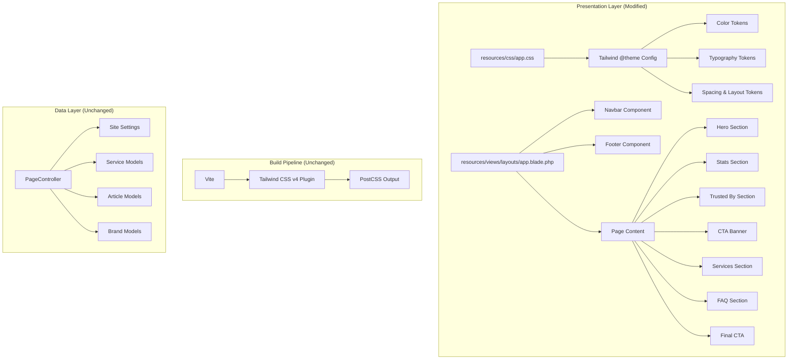
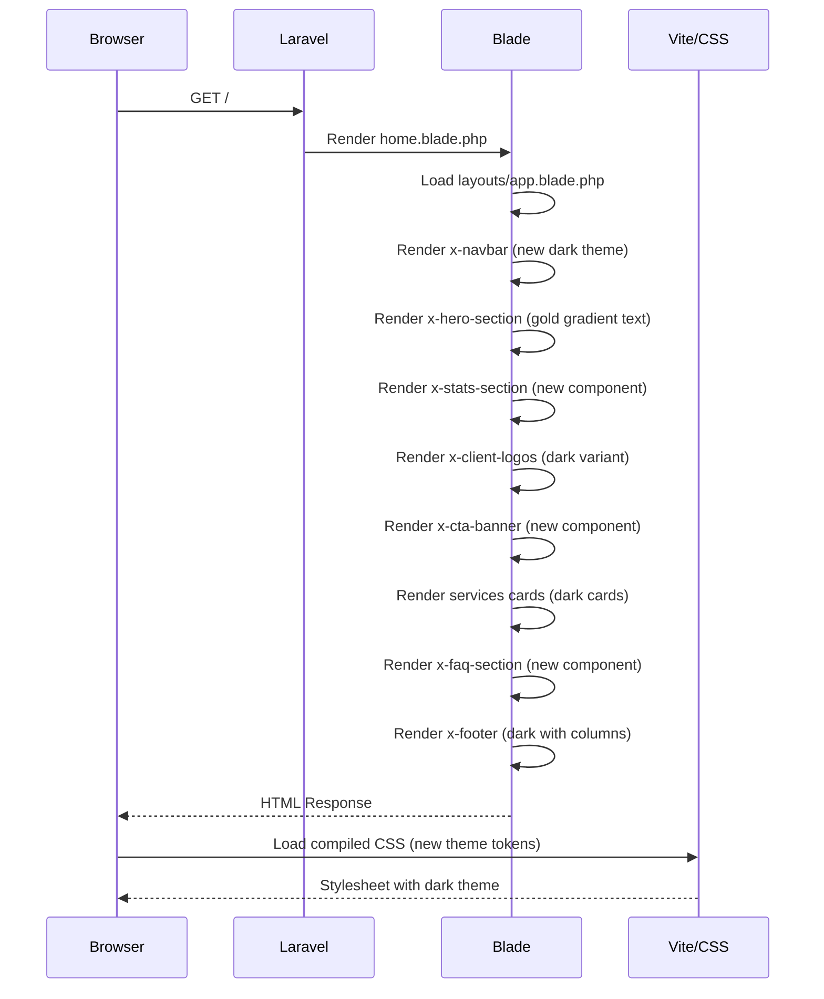
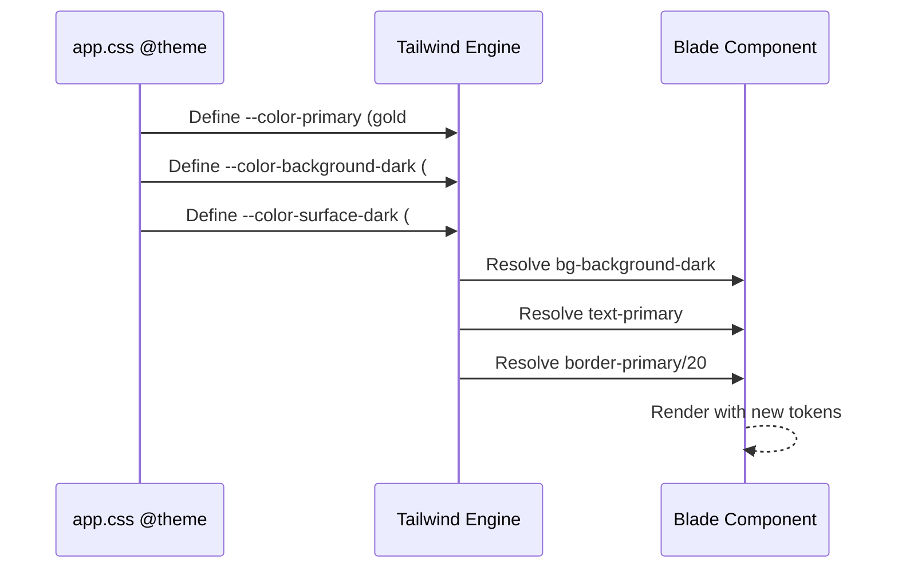

# Design Document: Theme Redesign

## Overview

This design document covers a complete visual theme redesign of the Grapadi International company profile website. The current theme uses a forest green (#3C6142) primary color with light/dark mode support. The new design adopts a premium dark theme with deep navy/black backgrounds and gold/amber accent colors, matching a high-end strategic consulting firm aesthetic.

The redesign involves updating the Tailwind CSS theme configuration (colors, typography, spacing), refactoring all Blade components to reflect the new visual language, updating the navigation structure to match the reference (Beranda, Layanan, Industri, Case Studies, Insights, Tentang Kami, Konsultasi), and adding new page sections (FAQ, stats with gold icons, final CTA banner). The existing component-based architecture (Laravel Blade + Tailwind CSS v4 + Alpine.js) is preserved — only the visual layer changes.

## Architecture

The application follows a standard Laravel MVC pattern with Blade component-based UI. The theme redesign modifies the presentation layer only, without touching controllers, models, or routes.



## Sequence Diagrams

### Page Load Flow



### Theme Token Resolution



## Components and Interfaces

### Component 1: Theme Configuration (app.css)

**Purpose**: Defines the design system tokens — colors, typography, and spacing that all components consume.

**Interface**:
```css
@theme {
    /* Primary = Gold/Amber */
    --color-primary: #C9A84C;
    --color-primary-50 through --color-primary-950;
    
    /* Backgrounds = Deep Dark Navy */
    --color-background-dark: #0A0A0F;
    --color-surface-dark: #12121A;
    
    /* Typography */
    --font-display: 'Cormorant Garamond', serif;
    --font-body: 'Montserrat', sans-serif;
}
```

**Responsibilities**:
- Define all color tokens consumed by utility classes
- Define font families for headings (serif) and body (sans-serif)
- Remove light mode / toggle — new design is dark-only
- Define gold gradient utilities for accent text

### Component 2: Navbar (navbar.blade.php)

**Purpose**: Top fixed navigation matching reference design with Indonesian menu items and gold CTA button.

**Interface**:
```php
@props([]) // No props — reads from site_settings and route config

// Navigation items:
// Beranda, Layanan, Industri, Case Studies, Insights, Tentang Kami
// CTA: "Konsultasi" (gold button)
```

**Responsibilities**:
- Always dark background (no transparent-on-scroll behavior)
- Logo on left, nav items center-left, CTA button right
- Mobile hamburger menu with slide-down panel
- Active page indicator (gold underline or text color)
- Remove dark mode toggle (site is now dark-only)

### Component 3: Hero Section (hero-section.blade.php)

**Purpose**: Full-width hero with dark building background, large serif headline with gold gradient text, and dual CTA buttons.

**Interface**:
```php
@props([
    'headline' => 'Strategic Advisory for High-Impact Decisions',
    'subheadline' => 'Market intelligence, feasibility studies...',
    'primaryCtaText' => 'Schedule Strategy Session',
    'primaryCtaUrl' => '/contact',
    'secondaryCtaText' => 'View Case Studies',
    'secondaryCtaUrl' => '/portfolio',
    'backgroundImage' => null,
    'stats' => [],
])
```

**Responsibilities**:
- Display headline with gold gradient on key words
- Two CTA buttons: primary (gold filled) and secondary (gold outline)
- Dark overlay on background image
- Stats bar below hero content (gold icons + numbers)

### Component 4: Stats Section (NEW - stats-section.blade.php)

**Purpose**: Display company statistics with gold accent icons in a 4-column grid.

**Interface**:
```php
@props([
    'stats' => [
        ['icon' => 'schedule', 'number' => '18+', 'label' => 'Years Experience'],
        ['icon' => 'task_alt', 'number' => '500+', 'label' => 'Projects Completed'],
        ['icon' => 'groups', 'number' => '120+', 'label' => 'Corporate Clients'],
        ['icon' => 'trending_up', 'number' => 'Rp5T+', 'label' => 'Investment Analysed'],
    ]
])
```

**Responsibilities**:
- 4-column responsive grid (2 cols on mobile)
- Gold-colored Material Icons
- Large bold numbers with descriptive labels
- Dark card or transparent background with subtle borders

### Component 5: CTA Banner (NEW - cta-banner.blade.php)

**Purpose**: Mid-page call-to-action banner with bordered card design.

**Interface**:
```php
@props([
    'title' => 'Ready to Transform Insight into Action?',
    'description' => '',
    'ctaText' => 'Book Consultation',
    'ctaUrl' => '/contact',
])
```

**Responsibilities**:
- Dark card with gold/amber border
- Centered text with gold accent
- Single CTA button (gold filled)

### Component 6: FAQ Section (NEW - faq-section.blade.php)

**Purpose**: Expandable FAQ items in a 2-column grid layout.

**Interface**:
```php
@props([
    'title' => 'Pertanyaan yang Sering Diajukan',
    'faqs' => [] // Array of ['question' => '', 'answer' => '']
])
```

**Responsibilities**:
- Section heading centered
- 2-column grid on desktop, 1 column on mobile
- Each FAQ item is expandable/collapsible (Alpine.js x-data)
- Dark card styling with subtle border
- Gold accent on expand/collapse icon

### Component 7: Service Card (service-card.blade.php - Refactored)

**Purpose**: Display individual service offering in a dark card with gold accent.

**Interface**:
```php
@props([
    'icon' => 'analytics',
    'title' => 'Service Title',
    'description' => '',
    'link' => '#',
    'linkText' => 'Explore',
])
```

**Responsibilities**:
- Dark surface background with subtle border
- Gold icon accent
- White title text, muted gray description
- Gold "Explore →" link at bottom

### Component 8: Footer (footer.blade.php - Refactored)

**Purpose**: Site footer with dark styling, multi-column layout matching reference.

**Interface**:
```php
// Reads from site_settings
// Columns: Menu, Layanan, Kontak
// Social media icons row
// Copyright bar
```

**Responsibilities**:
- Very dark background (#0A0A0F or similar)
- Logo and company name top-left
- 3 link columns: Menu, Layanan, Kontak
- Social media icon row (LinkedIn, Instagram, etc.)
- Copyright text at bottom
- Gold accent on hover states

## Data Models

### Theme Token Schema

```php
// Tailwind CSS v4 @theme block — defines the design system

interface ThemeTokens {
    // Colors
    primary: '#C9A84C';           // Gold/Amber
    primary_light: '#D4B85C';     // Lighter gold for hover
    primary_dark: '#A88A3C';      // Darker gold for active
    background_dark: '#0A0A0F';   // Page background
    surface_dark: '#12121A';      // Card/section backgrounds
    surface_darker: '#0D0D14';    // Elevated surfaces
    border_dark: '#1E1E2A';       // Default borders
    border_gold: 'rgba(201, 168, 76, 0.2)'; // Gold accent borders
    text_white: '#FFFFFF';        // Primary text
    text_muted: '#9CA3AF';        // Secondary text
    text_gold: '#C9A84C';         // Accent text
    
    // Typography
    font_display: 'Cormorant Garamond, serif';
    font_body: 'Montserrat, sans-serif';
    
    // Spacing (keep existing Tailwind defaults)
}
```

**Validation Rules**:
- All color tokens must have sufficient contrast ratio (WCAG AA: 4.5:1 for normal text)
- Gold text (#C9A84C) on dark background (#0A0A0F) = ~7.2:1 contrast ✓
- White text (#FFFFFF) on dark background = ~19.6:1 contrast ✓
- Muted text (#9CA3AF) on dark background = ~7.1:1 contrast ✓

### Navigation Item Schema

```php
// Navigation structure matching reference design
interface NavItem {
    label: string;       // "Beranda", "Layanan", etc.
    url: string;         // Route URL
    isActive: boolean;   // Current page indicator
    children?: NavItem[]; // Dropdown items (for Layanan, Industri)
    isCta: boolean;      // True for "Konsultasi" button
}
```

### FAQ Item Schema

```php
interface FaqItem {
    question: string;
    answer: string;
    isOpen: boolean;  // Alpine.js state
}
```

## Algorithmic Pseudocode

### Theme Application Strategy

```pascal
ALGORITHM applyThemeRedesign()
INPUT: Existing Blade components, CSS theme configuration
OUTPUT: Updated components with new dark + gold theme

BEGIN
  // Phase 1: Update CSS design tokens
  REPLACE @theme block in app.css WITH new color palette
  REPLACE font-family declarations WITH Cormorant Garamond + Montserrat
  REMOVE light mode color tokens (site is dark-only)
  ADD gold gradient utility class
  
  // Phase 2: Update layout
  UPDATE layouts/app.blade.php:
    SET html class to "dark" (always)
    REMOVE dark mode toggle logic
    UPDATE Google Fonts link to include Cormorant Garamond + Montserrat
  
  // Phase 3: Refactor existing components
  FOR EACH component IN [navbar, hero-section, service-card, footer, cta-section, client-logos]
    REPLACE bg-white/bg-surface-light references WITH bg-background-dark/bg-surface-dark
    REPLACE text-gray-900 WITH text-white
    REPLACE text-primary (green) WITH text-primary (gold)
    UPDATE border colors to use border-dark or border-gold
    ADJUST spacing and sizing per reference
  END FOR
  
  // Phase 4: Create new components
  CREATE stats-section.blade.php WITH gold icons + stats grid
  CREATE cta-banner.blade.php WITH bordered card design
  CREATE faq-section.blade.php WITH expandable items + 2-col grid
  
  // Phase 5: Update navigation structure
  UPDATE navbar items: [Beranda, Layanan, Industri, Case Studies, Insights, Tentang Kami]
  ADD "Konsultasi" gold CTA button
  REMOVE dark mode toggle button
  SET navbar to always-dark (no transparent state)
  
  // Phase 6: Update home page composition
  UPDATE pages/home.blade.php to use new section order:
    1. Hero (gold gradient headline + dual CTAs)
    2. Stats (4-column gold icons)
    3. Trusted By (dark background logos)
    4. CTA Banner ("Ready to Transform...")
    5. Services (dark cards, gold accents)
    6. FAQ (2-column expandable)
    7. Final CTA ("Let's Build Your Next Strategic Move")
    8. Footer
END
```

**Preconditions:**
- Tailwind CSS v4 with @theme support is installed (confirmed in package.json)
- Vite build pipeline is operational
- All existing Blade components exist at expected paths

**Postconditions:**
- Site renders exclusively in dark mode with gold/amber accents
- All text maintains WCAG AA contrast ratios on dark backgrounds
- Navigation reflects new menu structure
- All new components are responsive (mobile-first)
- No breaking changes to data models or controllers

### Color Token Migration

```pascal
ALGORITHM migrateColorTokens()
INPUT: Current @theme CSS block
OUTPUT: Updated @theme with dark + gold palette

BEGIN
  // Remove green primary palette
  REMOVE --color-primary-50 through --color-primary-950 (green values)
  REMOVE --color-navy-brand
  
  // Add gold primary palette
  SET --color-primary-50 = #FDF8E8
  SET --color-primary-100 = #F9EDCC
  SET --color-primary-200 = #F0D88F
  SET --color-primary-300 = #E5C157
  SET --color-primary-400 = #D4B04A
  SET --color-primary-500 = #C9A84C  // Main gold
  SET --color-primary-600 = #A88A3C
  SET --color-primary-700 = #866D2F
  SET --color-primary-800 = #6B5726
  SET --color-primary-900 = #5A491F
  SET --color-primary-950 = #322810
  SET --color-primary = #C9A84C
  
  // Update background tokens
  SET --color-background-dark = #0A0A0F
  SET --color-surface-dark = #12121A
  
  // Remove light mode tokens
  REMOVE --color-background-light
  REMOVE --color-surface-light
  
  // Add new utility tokens
  SET --color-border-dark = #1E1E2A
  SET --color-border-gold = rgba(201, 168, 76, 0.2)
END
```

## Key Functions with Formal Specifications

### Function: Gold Gradient Text Utility

```css
/* CSS utility for gold gradient text (applied via class) */
.text-gold-gradient {
    background: linear-gradient(135deg, #C9A84C 0%, #E5C157 50%, #C9A84C 100%);
    -webkit-background-clip: text;
    -webkit-text-fill-color: transparent;
    background-clip: text;
}
```

**Preconditions:**
- Element must contain text content
- Element must be inline or inline-block for gradient to clip to text

**Postconditions:**
- Text displays with gold gradient effect
- Gradient is visible on dark backgrounds
- Falls back to solid gold color if background-clip not supported

### Function: FAQ Toggle (Alpine.js)

```javascript
// Alpine.js component for FAQ accordion
function faqItem() {
    return {
        isOpen: false,
        toggle() {
            this.isOpen = !this.isOpen;
        }
    }
}
```

**Preconditions:**
- Alpine.js is loaded (confirmed in existing setup)
- FAQ item has both question and answer content

**Postconditions:**
- Clicking question toggles answer visibility
- Only one item open at a time (optional — per UX preference)
- Smooth expand/collapse animation via x-collapse or CSS transition

### Function: Navbar Scroll Behavior

```javascript
// Simplified navbar — always dark, subtle shadow on scroll
function navbar() {
    return {
        scrolled: false,
        mobileMenuOpen: false,
        init() {
            window.addEventListener('scroll', () => {
                this.scrolled = window.pageYOffset > 20;
            });
        }
    }
}
```

**Preconditions:**
- Alpine.js x-data is bound to nav element
- Window scroll event is available

**Postconditions:**
- Navbar always has dark background
- Shadow appears after 20px scroll
- Mobile menu toggles correctly

## Example Usage

### Updated app.css @theme block

```css
@theme {
    --font-sans: 'Montserrat', ui-sans-serif, system-ui, sans-serif;
    --font-display: 'Cormorant Garamond', serif;
    --font-body: 'Montserrat', ui-sans-serif, system-ui, sans-serif;

    /* Primary colors - Gold/Amber */
    --color-primary-50: #FDF8E8;
    --color-primary-100: #F9EDCC;
    --color-primary-200: #F0D88F;
    --color-primary-300: #E5C157;
    --color-primary-400: #D4B04A;
    --color-primary-500: #C9A84C;
    --color-primary-600: #A88A3C;
    --color-primary-700: #866D2F;
    --color-primary-800: #6B5726;
    --color-primary-900: #5A491F;
    --color-primary-950: #322810;
    --color-primary: #C9A84C;

    /* Background colors - Deep Dark */
    --color-background-dark: #0A0A0F;
    --color-surface-dark: #12121A;
    --color-border-dark: #1E1E2A;
}
```

### New Hero Section Usage

```html
<section class="relative min-h-screen bg-background-dark flex items-center">
    
    <div class="absolute inset-0 bg-gradient-to-b from-background-dark/80 to-background-dark"></div>
    
    <div class="relative z-10 max-w-5xl mx-auto px-4 text-center">
        <h1 class="text-5xl md:text-7xl font-display font-bold text-white leading-tight mb-6">
            Strategic Advisory for<br>
            <span class="text-gold-gradient">High-Impact Decisions</span>
        </h1>
        <p class="text-xl text-gray-400 mb-10 max-w-2xl mx-auto">
            Market intelligence, feasibility studies, and strategic planning
        </p>
        <div class="flex flex-col sm:flex-row gap-4 justify-center">
            <a href="/contact" class="bg-primary hover:bg-primary-400 text-background-dark font-bold py-4 px-8 rounded">
                Schedule Strategy Session
            </a>
            <a href="/portfolio" class="border border-primary text-primary hover:bg-primary/10 font-bold py-4 px-8 rounded">
                View Case Studies
            </a>
        </div>
    </div>
</section>
```

### New Service Card Usage

```html
<div class="bg-surface-dark border border-border-dark rounded-xl p-8 hover:border-primary/30 transition group">
    <div class="w-14 h-14 bg-primary/10 rounded-lg flex items-center justify-center mb-6">
        <span class="material-icons-outlined text-3xl text-primary">{{ $icon }}</span>
    </div>
    <h3 class="text-2xl font-display font-bold text-white mb-3">{{ $title }}</h3>
    <p class="text-gray-400 mb-6 leading-relaxed">{{ $description }}</p>
    <a href="{{ $link }}" class="text-primary font-semibold flex items-center gap-2 group-hover:gap-3 transition-all">
        {{ $linkText }}
        <span class="material-icons-outlined text-sm">arrow_forward</span>
    </a>
</div>
```

## Correctness Properties

*A property is a characteristic or behavior that should hold true across all valid executions of a system — essentially, a formal statement about what the system should do. Properties serve as the bridge between human-readable specifications and machine-verifiable correctness guarantees.*

### Property 1: Dark-only consistency

*For any* page and any component rendered on the site, no light mode CSS classes or tokens shall be present, and the HTML root element shall always carry the "dark" class.

**Validates: Requirements 1.5**

### Property 2: Navbar scroll shadow

*For any* scroll position greater than 20 pixels, the Navbar shall have a shadow class applied; for any scroll position of 20 pixels or less, no shadow class shall be present.

**Validates: Requirements 3.4**

### Property 3: Active route indication

*For any* page route that is currently active, the corresponding Navbar menu item shall have gold styling (gold text color or underline) applied, and no other menu item shall have that active indicator.

**Validates: Requirements 3.6**

### Property 4: Stat item rendering completeness

*For any* stat item passed to the Stats_Section component, the rendered output shall contain a gold-colored icon element, a bold numeric value, and a descriptive label text.

**Validates: Requirements 5.3**

### Property 5: FAQ interaction and keyboard accessibility

*For any* FAQ item in the FAQ_Section, clicking or pressing Enter/Space on the question element shall toggle the answer visibility, and the toggle element shall have appropriate ARIA attributes (aria-expanded, aria-controls).

**Validates: Requirements 7.3, 7.5**

### Property 6: Service card element completeness

*For any* Service_Card rendered with valid props (icon, title, description, link), the output shall contain a gold-colored icon, white title text, muted gray description text, and a gold link with arrow indicator.

**Validates: Requirements 8.2**

### Property 7: Color contrast compliance

*For any* text and background color combination defined in the Theme_System token set, the contrast ratio shall meet or exceed the WCAG AA minimum of 4.5:1 for normal text.

**Validates: Requirements 10.1**

### Property 8: Focus indicator visibility

*For any* interactive element (buttons, links, toggles, inputs) that receives keyboard focus, a visible focus indicator shall be displayed.

**Validates: Requirements 10.4**

### Property 9: No horizontal overflow

*For any* viewport width between 320px and 2560px inclusive, all page content shall render without horizontal overflow (no horizontal scrollbar).

**Validates: Requirements 11.1**

### Property 10: Graceful degradation with null settings

*For any* component that reads from site_settings, if the setting value is null, the component shall render using a predefined fallback value without producing a rendering error or visual breakage.

**Validates: Requirements 13.4**

## Error Handling

### Error Scenario 1: Google Fonts Unavailable

**Condition**: CDN for Google Fonts is unreachable or slow
**Response**: System uses CSS font-stack fallbacks — serif system fonts for display, sans-serif for body
**Recovery**: `font-display: swap` ensures text is always visible; preconnect hints reduce load time

### Error Scenario 2: Background Image Fails to Load

**Condition**: Hero background image returns 404 or times out
**Response**: Dark background color (#0A0A0F) shows through — the design remains coherent without the image
**Recovery**: No explicit error state needed; gradient overlay ensures text remains readable regardless

### Error Scenario 3: Alpine.js Not Loaded

**Condition**: JavaScript fails to load or execute
**Response**: FAQ items show all answers expanded (no toggle); mobile menu link shows as fallback navigation
**Recovery**: Use `<noscript>` styles to handle graceful degradation; FAQ answers visible by default with `x-show` initial state

### Error Scenario 4: Missing Site Settings

**Condition**: Database returns null for site_setting() calls (logo, company name, etc.)
**Response**: Fallback values are defined in each site_setting() call
**Recovery**: Components render with sensible defaults; no visual breakage

## Testing Strategy

### Visual Regression Testing

- Use Percy or Playwright visual snapshots to compare before/after theme changes
- Capture key breakpoints: 375px (mobile), 768px (tablet), 1440px (desktop)
- Test pages: Home, Services, About, Contact

### Component Testing

- Test each new Blade component in isolation with Laravel Dusk or PHPUnit view tests
- Verify props render correctly
- Verify responsive classes apply at correct breakpoints

### Accessibility Testing

- Run axe-core automated checks on all pages
- Verify all interactive elements (FAQ toggles, mobile menu) are keyboard-accessible
- Verify color contrast meets WCAG AA for all text/background combinations
- Verify proper heading hierarchy (h1 → h2 → h3)

### Cross-Browser Testing

- Test in Chrome, Firefox, Safari, Edge
- Verify gold gradient text renders correctly (webkit prefix)
- Verify CSS custom properties resolve in all target browsers

## Performance Considerations

- **Font Loading**: Use `font-display: swap` and preconnect to Google Fonts. Consider self-hosting Cormorant Garamond and Montserrat for faster TTFB.
- **Background Images**: Use WebP/AVIF with fallback. Lazy-load non-hero images.
- **CSS Size**: Removing light mode tokens and unused green palette reduces CSS bundle size.
- **LCP Optimization**: Hero background image should have `fetchpriority="high"` and no lazy loading.
- **Dark Mode Only**: Eliminating the dual-theme system simplifies CSS and reduces toggle-related JS.

## Security Considerations

- No new security concerns introduced — this is a presentation-layer change only.
- Existing CSRF protection, input validation, and auth middleware remain unchanged.
- External font CDN links use `crossorigin` attribute for proper CORS handling.

## Dependencies

| Dependency | Purpose | Status |
|-----------|---------|--------|
| Tailwind CSS v4 | Utility-first CSS framework | Existing |
| Alpine.js | Interactive components (FAQ, mobile menu) | Existing |
| @alpinejs/intersect | Scroll animations | Existing |
| Vite | Build tool | Existing |
| Google Fonts (Cormorant Garamond) | Display/heading serif font | New (CDN) |
| Google Fonts (Montserrat) | Body sans-serif font | Existing |
| Material Icons Outlined | Icon system | Existing |

No new npm packages required. The redesign uses only existing infrastructure with updated configuration.
